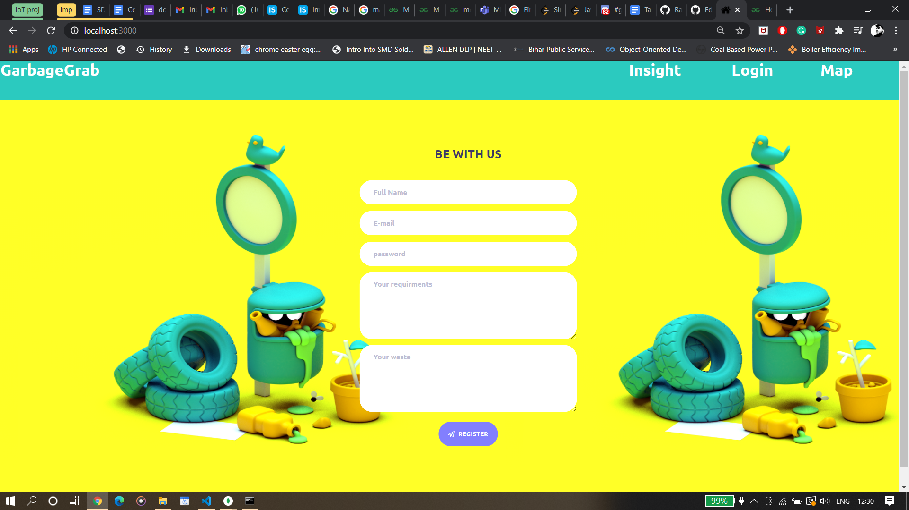
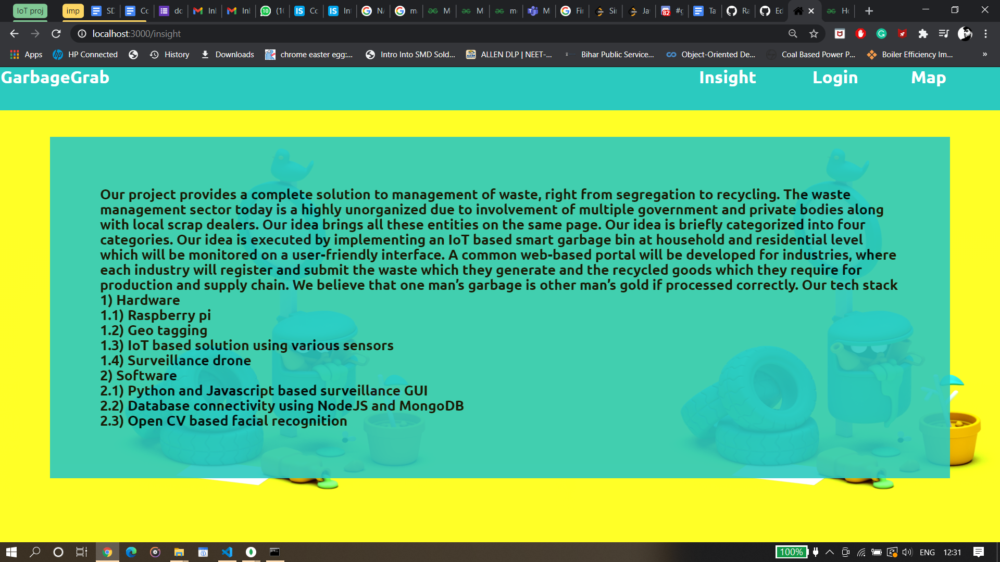
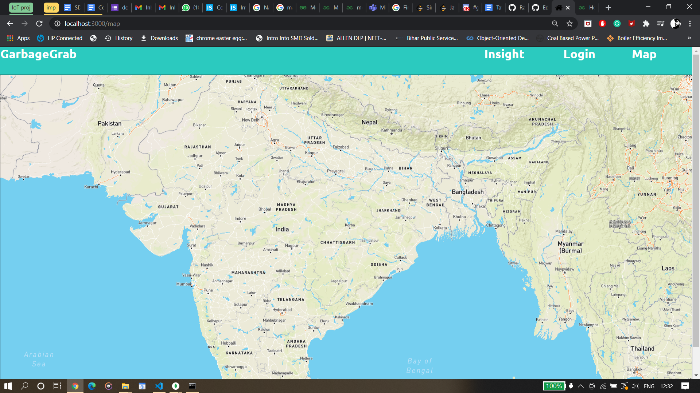

# GarbageGrab
This project provides a complete solution to management of waste, right from segregation to recycling. The waste management sector today is a highly unorganized due to involvement of multiple government and private bodies along with local scrap dealers. GarbageGrab brings all these entities on the same page. Our idea is executed by implementing an IoT based smart garbage bin at household and residential level which will be monitored on a user-friendly interface. A common web-based portal is developed for industries, where each industry will register and submit the waste which they generate and the recycled goods which they require for production and supply chain. 

# Running on localhost

- clone or download the "GarbageGrab" repository.
- open MongoDb and create a database as "mydb"
- create a collection in mydb database, name it as "Employee"
- open the cmd int the same directory of the GarabgeGrab.
- run the command "npm run devStart"
- goto http://localhost:3000/
        
        
